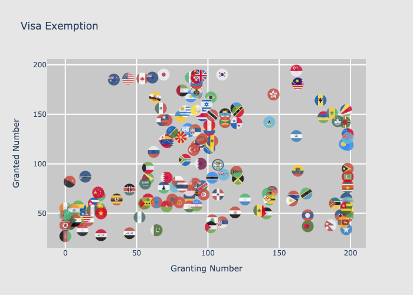

# Passport strength

This repository contains some codes and datasets to learn passport strength across the world.

For example, we can view that for each country/area, how many numbers of visa exemptions do they give out vs. receive from other countires/areas.

We can also learn how passport strength is related to population and income status.

## Data

Latest update: June 2023

The visa data is from https://visaindex.com

Population and income data are from https://data.worldbank.org

## Files

[Scripts](scripts/) contain three python scripts.
- [scrap_visa_data.py](scripts/scrap_visa_data.py) scraps and compute visa data from https://visaindex.com
- [merge_data.py](scripts/merge_data.py) merges visa data and world bank data.
- [plot_smaples.py](scripts/plot_samples.py) creates the sample figures shown above.

[Data](data/) contains the following information.
- [visa_population_income.csv](data/visa_population_income.csv) is the merged dataset for analysis.
- [visa_data.json](data/visa_data.json) is the scrapped data from https://visaindex.com
- [API_SP](data/API_SP/) contains the data downloaded from https://data.worldbank.org
- [flags](data/flags/) contains several flag images that require manual updates.

[Images](images/) contains the sample figures shown above.